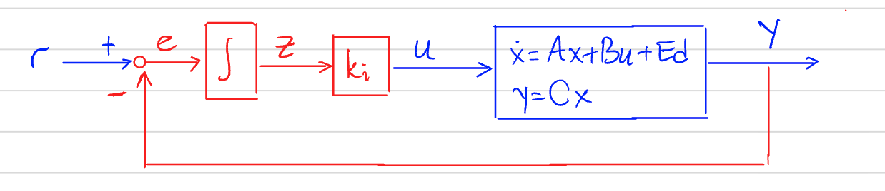
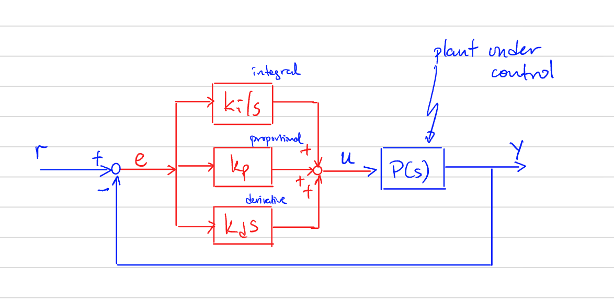
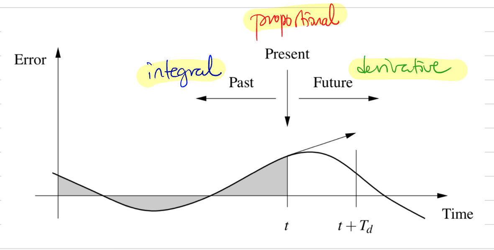
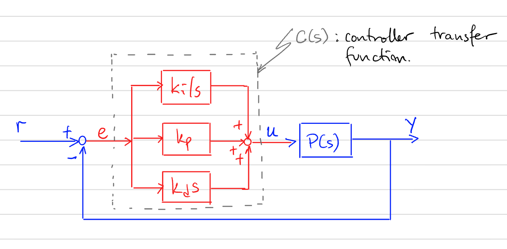
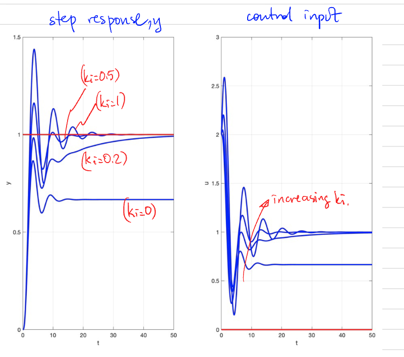
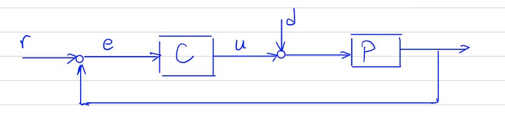

---
jupytext:
  formats: md:myst
  text_representation:
    extension: .md
    format_name: myst
    format_version: 0.13
    jupytext_version: 1.16.1
kernelspec:
  display_name: Python 3
  language: python
  name: python3
---

# PID Lecture Note to Markdown

## Earlier

Linear System: $x = A x + B u$ , $y = C x + D u$ 

Input: $u(t) = e^{s t}$ (complex $s \neq \lambda (A)$ ).

Steady-state output: $y_{ss}(t) = \underbrace{\left[D + C(s) - A\right]^{-1} B_{s}}_{\text{Transfer Function}} u(t)$ 

## Last lecture

For an ODE with output $y$ and input $u$ of the form

$$
\frac{d^{n} y}{d t^{n}} + a_{1} \frac{d^{n - 1} y}{d t^{n - 1}} + \dots + a_{n} y
$$

$$
= b_{0} \frac{d^{m} u}{d t^{m}} + b_{1} \frac{d^{m - 1} y}{d t^{m - 1}} + \dots + b_{m} u
$$

the transfer function is

$$ G(s) = \frac{b(s)}{a(s)} = \frac{b_{0} s^{m} + b_{1} s^{m - 1} + \cdots + b_{m}}{s^{n} + a_{1} s^{n - 1} + \cdots + a_{n}} $$

- Poles of $G =$ roots of $a(s) = 0$ 
- Zeros of $G =$ roots of $b(s) = 0$ 
- "Poles of $G =$ eigenvalues of $A$ " 

---

# PID Controllers

## Proportional–Integral–Derivative (PID) Control

Recall the control structure from before: we used **integral action**.  

Now we will work with the **transfer function representation** of the system and controller.
Additionally, we will extend the controller structure.

- Error signal:  
  $$
  e(t) = r(t) - y(t)
  $$

- Control input:  
  $$
  u(t) = k_p e(t) + k_i \int e(t) \, dt + k_d \frac{de(t)}{dt}
  $$

- Transfer function from $e$ to $u$:
  $$
  C(s) = k_p + \frac{k_i}{s} + k_d s
  $$

### Another Interpretation of P, I, D terms:

- **Proportional**: part depends on the instantaneous error.  
- **Integral** part based on error up to time $t$. 
- **Derivative** part estimates the growth of the error.

---

## Closed-Loop Transfer Function with a PID controller

The transfer function from reference $r$ to output $y$ is:

$$
G_{ry}(s) = \frac{P(s)C(s)}{1 + P(s)C(s)}
$$

- Steady-state gain for a stable system under step input is $H(0)$.

---

First, consider **pure proportional feedback** (i.e., $k_i = 0$ and $k_d = 0$).

The steady-state output due to a unit step reference input is equal to:

$$
y_{ss} = G_{ry}(0) \cdot 1 = \frac{C(0) P(0)}{1 + C(0) P(0)}
$$

Since

$$
C(s) = k_p \;\;\; \Rightarrow \;\;\; C(0) = k_p,
$$

we have

$$
y_{ss} = \frac{k_p P(0)}{1 + k_p P(0)}.
$$

*One can adjust $k_p$ to make $y_{ss}$ as close to 1 as possible.*

---

## Example (with P-term only)

$$P(s) = \frac{1}{(s+1)^3}$$

Increase $k_p$:
- reduces the steady-state error,
- but also introduces (larger) oscillations and overshoot.

---
### Integral Feedback

Introduce **integral feedback**:  

$$
C(s) = k_p + \frac{k_i}{s}
$$

The closed-loop transfer function:

$$
G_{ry}(s) = \frac{\left(k_p + \tfrac{k_i}{s}\right) P(s)}{1 + P(s)\left(k_p + \tfrac{k_i}{s}\right)}
$$

Simplify:

$$
G_{ry}(s) = \frac{(k_p s + k_i)\tfrac{1}{s} P(s)}{s + P(s)(k_p s + k_i)\tfrac{1}{s}}
= \frac{(k_p s + k_i) P(s)}{s + P(s)(k_p s + k_i)}
$$

The steady-state output due to unit step reference input:

$$
G_{ry}(0) = \frac{k_i P(0)}{k_i P(0)} = 1
$$

- **Perfect reference tracking**  
- **Independent from the plant parameters**

**Recall:**  
This is an important result. But, it is not news for us. We already had seen this fact. We just derived it in a different way now.

---

## Example (with P and I terms)
Same plant as before. Fixed $k_p = 2$ and vary $k_i$:

- Zero $k_i \Rightarrow$ non-zero steady-state error  
- Nonzero $k_i \Rightarrow$ zero steady-state error  
- As $k_i$ increases, the approach to the steady-state output is faster.  
- As $k_i$ increases, the system becomes more oscillatory.  

---

Another useful property of integral action: disturbance attenuation.

Assume $r = 0$ and $d$ is a unit step disturbance.  

Only integral action:  
$$
C(s) = \frac{k_i}{s}
$$

The closed-loop transfer function:

$$
G_{dy}(s) = \frac{P(s)}{1 + P(s)C(s)}
= \frac{s P(s)}{s + P(s) k_i}
$$

At steady state:

$$
G_{dy}(0) = \frac{0}{P(0) k_i} = 0
$$
(Perfect disturbance rejection at steady state.)

Let us now add the derivative term

$$
C(s) = k_p + \frac{k_i}{s} + k_d s
$$

Check the response under unit step reference $r$:

<src src="_static/images/pid_8.png" alt="PID example with D term" style="width:70%;">

With increasing $k_d$, the closed-loop system becomes more damped.

---

### Example: Effect of the $k_d$-term

Let the reference be $r = 0$.  
We will analyze the free response of the closed-loop system.

**Open-loop system:**

$$
\ddot{y} + \alpha_1 \dot{y} + \alpha_2 y = u
$$

**Derivative control:**

$$
u = k_d \dot{e} = k_d (\dot{r} - \dot{y}) = -k_d \dot{y}
$$

**Closed-loop system:**

$$
\ddot{y} + (\alpha_1 + k_d)\dot{y} + \alpha_2 y = 0
$$

- $\alpha_2$: unchanged $\;\;\Rightarrow\;\; \omega_n$: unchanged  
- Choose $k_d$ to increase damping:  

$$
\alpha_1 + k_d = 2 \zeta \omega_n
$$
